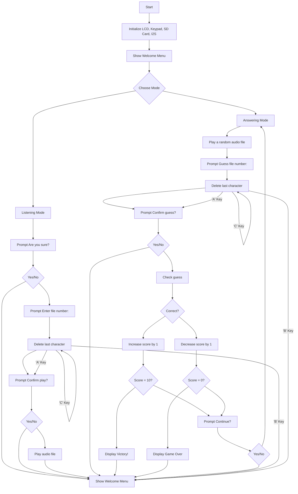

# Arduino Audio Player with Keypad Interaction

## Overview

This project involves creating an interactive audio player using an Arduino Mega. The device features an I2C LCD 2004 display, a 4x4 keypad for user input, a buzzer for sound alerts, a memory card module for storage, and a speaker module connected via I2S for audio output. Users can choose between two modes: Listening Mode and Answering Mode.

### Keypad Layout

- **Listening Mode**: 'A'
- **Answering Mode**: 'B'
- **Yes**: 'A'
- **No**: 'B'
- **Enter**: 'A'
- **Cancel**: 'B'
- **Delete Character**: 'C'

## Components Required

- Arduino Mega
- I2C LCD 2004 Display
- 4x4 Keypad
- Buzzer
- SD Card Module
- Speaker Module (I2S)
- Connecting wires and breadboard

## Circuit Diagram

1. **LCD Connections**:
   - VCC to 5V
   - GND to GND
   - SDA to SDA (pin 20 on Arduino Mega)
   - SCL to SCL (pin 21 on Arduino Mega)

2. **Keypad Connections**:
   - Connect the row and column pins of the keypad to digital pins 2 through 9 on the Arduino.

3. **Buzzer**:
   - Connect the positive terminal to digital pin 12
   - Connect the negative terminal to GND

4. **SD Card Module**:
   - VCC to 5V
   - GND to GND
   - MISO to MISO (pin 50 on Arduino Mega)
   - MOSI to MOSI (pin 51 on Arduino Mega)
   - SCK to SCK (pin 52 on Arduino Mega)
   - CS to pin 53

5. **Speaker Module (I2S)**:
   - WS to pin 19
   - BCLK to pin 18
   - DIN to pin 22
   - GND to GND
   - VCC to 5V

## Installation

1. **Arduino IDE**:
   - Install the Arduino IDE from [here](https://www.arduino.cc/en/software).

2. **Libraries**:
   - Install the following libraries through the Arduino Library Manager:
     - `LiquidCrystal_I2C`
     - `Keypad`
     - `SD`
     - `I2S`

3. **Connections**:
   - Make the connections as per the circuit diagram.

## Code

Here is the complete Arduino code for the project:

```cpp
#include <Wire.h>
#include <LiquidCrystal_I2C.h>
#include <Keypad.h>
#include <SD.h>
#include <SPI.h>
#include <I2S.h>

// LCD setup
LiquidCrystal_I2C lcd(0x27, 20, 4);  // I2C address 0x27, 20 column, 4 row

// Keypad setup
const byte ROWS = 4; // Four rows
const byte COLS = 4; // Four columns
char keys[ROWS][COLS] = {
  {'1','2','3','A'},
  {'4','5','6','B'},
  {'7','8','9','C'},
  {'*','0','#','D'}
};
byte rowPins[ROWS] = {9, 8, 7, 6};  // Connect to the row pinouts of the keypad
byte colPins[COLS] = {5, 4, 3, 2};  // Connect to the column pinouts of the keypad
Keypad keypad = Keypad(makeKeymap(keys), rowPins, colPins, ROWS, COLS);

// Pins for buzzer
const int buzzerPin = 12;  // Buzzer

// SD card setup
const int chipSelect = 53; // SD card CS pin

// Variables
int score = 5;

// Function declarations
void showWelcomeMenu();
void listeningMode();
void answeringMode();
void playAudioFile(int fileNumber);
void promptConfirmation(const char* message, void (*yesCallback)(), void (*noCallback)());
void getKeypadInput(char* inputBuffer, size_t bufferSize);

void setup() {
  lcd.init();
  lcd.backlight();
  Serial.begin(9600);
  pinMode(buzzerPin, OUTPUT);

  if (!SD.begin(chipSelect)) {
    lcd.print("SD init failed!");
    while (1);
  }
  lcd.print("SD init done.");

  if (!I2S.begin(I2S_PHILIPS_MODE, 44100, 16)) {
    lcd.print("I2S init failed!");
    while (1);
  }
  lcd.print("I2S init done.");

  showWelcomeMenu();
}

void loop() {
  // Empty, as all actions are handled within functions and callbacks
}

void showWelcomeMenu() {
  lcd.clear();
  lcd.setCursor(0, 0);
  lcd.print("Welcome!");
  lcd.setCursor(0, 1);
  lcd.print("A: Listening");
  lcd.setCursor(0, 2);
  lcd.print("B: Answering");

  while (true) {
    char key = keypad.getKey();
    if (key == 'A') {
      listeningMode();
      break;
    }
    if (key == 'B') {
      answeringMode();
      break;
    }
  }
}

void listeningMode() {
  promptConfirmation("Are you sure?", [](){
    lcd.clear();
    lcd.print("Enter file number:");
    char input[4] = "";  // Buffer to hold the input
    getKeypadInput(input, sizeof(input));
    int fileNumber = atoi(input); // Convert char array to int

    promptConfirmation("Confirm play?", [fileNumber](){
      playAudioFile(fileNumber);
    }, showWelcomeMenu);
  }, showWelcomeMenu);
}

void answeringMode() {
  int fileNumber = random(0, 10); // Assuming files are numbered 0-9
  playAudioFile(fileNumber);

  lcd.clear();
  lcd.print("Guess file number:");
  char input[4] = "";  // Buffer to hold the input
  getKeypadInput(input, sizeof(input));

  promptConfirmation("Confirm guess?", [fileNumber, input](){
    int guess = atoi(input); // Convert char array to int

    if (guess == fileNumber) {
      score++;
      lcd.clear();
      lcd.print("Correct! Score: ");
      lcd.print(score);
    } else {
      score--;
      lcd.clear();
      lcd.print("Wrong! Score: ");
      lcd.print(score);
    }

    if (score == 0) {
      lcd.clear();
      lcd.print("Game Over");
      while (true);
    } else if (score == 10) {
      lcd.clear();
      lcd.print("Victory!");
      while (true);
    } else {
      promptConfirmation("Continue?", answeringMode, showWelcomeMenu);
    }
  }, answeringMode);
}

void playAudioFile(int fileNumber) {
  String fileName = String(fileNumber) + ".wav";
  File audioFile = SD.open(fileName);

  if (audioFile) {
    while (audioFile.available()) {
      I2S.write(audioFile.read());
    }
    audioFile.close();
  } else {
    lcd.clear();
    lcd.print("File not found.");
    while (true) {
      char key = keypad.getKey();
      if (key == 'B') {
        showWelcomeMenu();
        break;
      }
    }
  }
}

void promptConfirmation(const char* message, void (*yesCallback)(), void (*noCallback)()) {
  lcd.clear();
  lcd.print(message);
  lcd.setCursor(0, 1);
  lcd.print("A: Yes  B: No");

  while (true) {
    char key = keypad.getKey();
    if (key == 'A') {
      yesCallback();
      break;
    }
    if (key == 'B') {
      noCallback();
      break;
    }
  }
}

void getKeypadInput(char* inputBuffer, size_t bufferSize) {
  size_t index = 0;
  while (true) {
    char key = keypad.getKey();
    if (key) {
      if (key == 'A') {  // Enter
        inputBuffer[index] = '\0';
        return;
      } else if (key == 'B') {  // Cancel
        inputBuffer[0] = '\0';
        return;
      } else if (key == 'C') {  // Delete character
        if (index > 0) {
          index--;
          lcd.setCursor(index, 1);
          lcd.print(' ');
          lcd.setCursor(index, 1);
        }
      } else if (isdigit(key) && index < bufferSize - 1) {
        inputBuffer[index++] = key;
        lcd.print(key);
      }
    }
  }
}
```

## Flowchart

Below is a detailed flowchart representing the functional flow of the system using Mermaid syntax:



## Summary

This project creates an interactive audio player using Arduino Mega, integrating an I2C LCD, 4x4 keypad, SD card, buzzer, and I2S speaker. The user can switch between Listening and Answering modes, with the ability to confirm actions, enter and delete file numbers, and check their guesses against randomly played files. The system handles scoring and provides feedback based on user interaction, making it a comprehensive and engaging experience.
